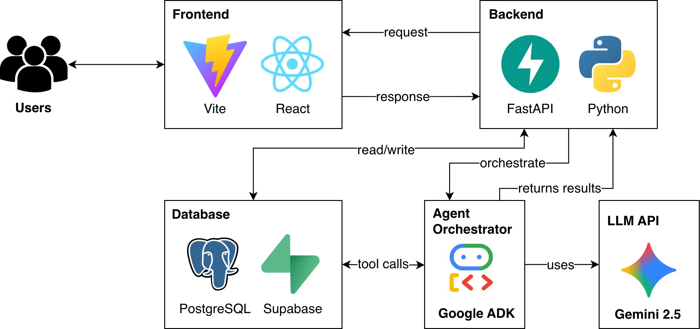

# Beacon: Autonomous Supply Chain Resilience Agent

Beacon is an agentic AI system that monitors global supply chain disruptions, assesses risk from live operational data, and proposes mitigation strategies with human-in-the-loop approval. It acts as a **strategic operations partner** that perceives signals, reasons about trade-offs, plans responses, and assists in executing mitigation workflows.

---

## Tech Architecture



The system is implemented as a **multi-agent pipeline** using **Google ADK**, with five layers: **Perception -> Reasoning -> Planning -> Action -> Reflection**, plus **Memory** and a central **Orchestrator (BeaconManager)**.

- **Frontend**: React + Vite + Tailwind CSS + TypeScript
- **Backend**: Python + FastAPI
- **Database**: PostgreSQL via Supabase
- **Agent Orchestration**: Google ADK
- **LLM**: Gemini 2.5

---

## Overview & Objectives

Global supply chains are volatile due to geopolitical conflict, climate events, trade policy shifts, and supplier instability. Mid-market manufacturers often lack dedicated risk intelligence. Beacon is designed to:

- **Monitor** global disruption signals (news, events, weather, trade, macro)
- **Assess** operational risk exposure across suppliers, logistics, and inventory
- **Simulate** trade-offs between cost, service levels, and resilience
- **Recommend** mitigation strategies (rerouting, alternative sourcing, buffer inventory)
- **Draft or trigger** operational actions (supplier communication, ERP adjustments)
- **Learn** from past disruptions to improve future recommendations

---

## Dashboard

### Active Disruption Alerts & KPIs


### Supply Chain Network Graph


### Recommended Mitigation Strategy


### Disruption Analysis & Risk Scoring


---

## Agent Architecture by Layer

The pipeline is **Perception -> Reasoning -> Planning -> Action -> Reflection**. Each layer is implemented in `agents/`; the **root agent** (`agents/root_agent.py`) chains all five.

### Layer 1 - Perception

Turns raw global signals into structured disruption events using external data sources:

- **GDACS** - Natural disaster alerts (earthquakes, cyclones, floods)
- **ACLED** - Conflict and protest events
- **Alpha Vantage** - Financial/sector news
- **FRED** - Macro indicators (interest, inflation, GDP)
- **OpenWeather** - Weather alerts for supplier regions
- **WTO** - Trade restrictions by supplier countries

### Layer 2 - Reasoning

Turns events and business context into scored **RiskCases** (probability x exposure x impact):

- **Cluster Agent** - Fuses and deduplicates signal events
- **Exposure Agent** - Maps clusters to business exposure
- **Hypothesis Agent** - Generates causal chain hypotheses
- **Scoring Agent** - Computes risk scores using configurable policy

### Layer 3 - Planning

Generates and ranks mitigation plans:

- **Plan Generator** - Creates candidate plans from action library
- **Scenario Simulator** - Predicts outcomes per plan
- **Execution Planner** - Ranks by feasibility and selects recommended plan

### Layer 4 - Action

Executes plans with human-in-the-loop approval:

- **Change Proposal Agent** - Translates plans into ERP diffs
- **Drafting Agent** - Drafts human-readable messages
- **Approval Agent** - Gates on human approve/reject
- **Commit Agent** - Pushes approved changes
- **Verification Agent** - Validates post-commit state
- **Audit Agent** - Records outcomes in audit log

### Layer 5 - Reflection

Compares predicted vs actual outcomes and updates organizational memory:

- **Outcome Evaluator** - Compares predicted vs actual risk reduction
- **Lesson Extractor** - Extracts generalized lessons for future use

---

## Running the Application

Use **two terminals**: backend (port 8000) and frontend.

### Backend (Terminal 1)

```bash
python -m venv venv
source venv/bin/activate  # macOS/Linux
pip install -r requirements.txt
python -m uvicorn backend.main:app --reload --port 8000
```

Set in `.env`: `GOOGLE_API_KEY`, `SUPABASE_URL`, `SUPABASE_SERVICE_KEY`, `ALPHA_VANTAGE_API_KEY`, `BEACON_COMPANY_ID`

### Frontend (Terminal 2)

```bash
cd frontend
npm install
npm run dev
```

Set in `frontend/.env`: `VITE_SUPABASE_URL`, `VITE_SUPABASE_ANON_KEY`, `VITE_API_URL=http://localhost:8000`

---

## Database

- **Schema**: `database/schema.sql` - company_profiles, suppliers, facilities, inventory, purchase_orders, signal_events, risk_cases, action_runs, change_proposals, audit_log, memory tables
- **Seed**: `database/seed.sql` - Demo organization profiles
- **Policies**: `database/policies.sql` - Row-level security

---

## Further Documentation

- `docs/architecture.md` - Pipeline status and agent responsibilities
- `docs/ui-mapping.md` - Frontend tabs to Supabase tables and API routes
- `docs/implementation-flow.md` - End-to-end implementation flow
- `agents/manager/README.md` - BeaconManager, session tracker, health monitor
